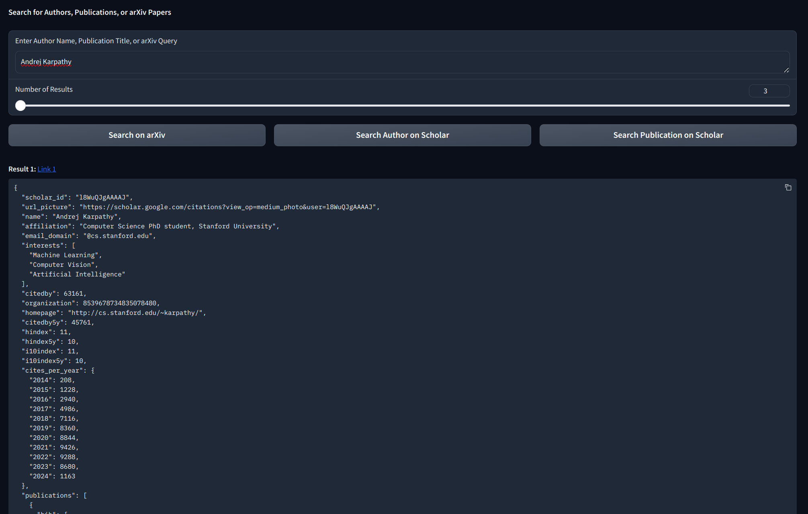
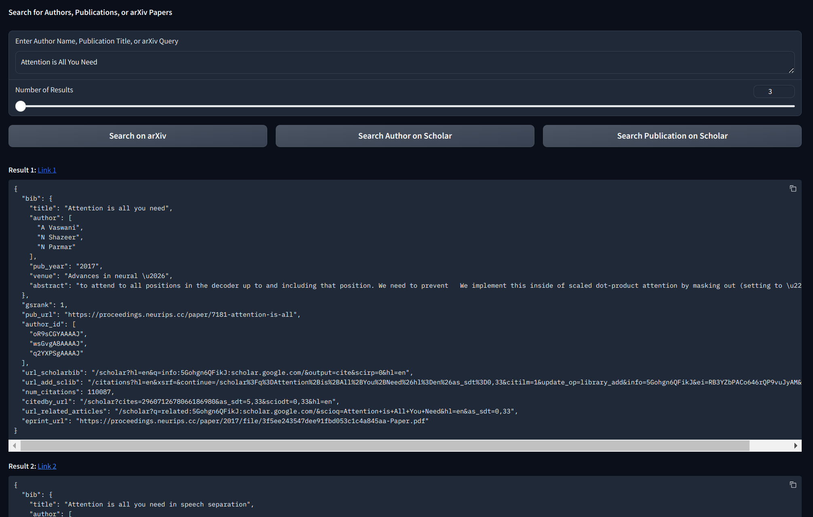
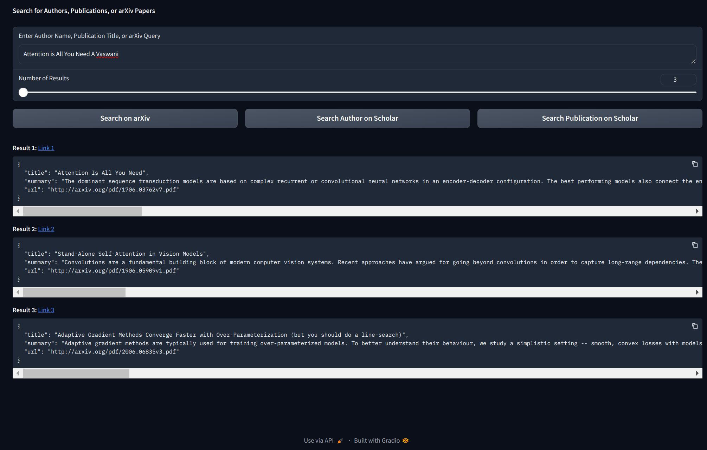

# rhizo-embed

This is a rhizomatic tool for searching for, storing, and embedding sources of all kinds within the Rhizome. 
WIP, currently just building in public and experimenting. Lacks Elasticsearch loading and ColBERTv2 index embedding.

It is intended as a tool to be used within a larger project and thus has a Flask api to hit with a web app, but it also contains a gradio app for standalone use and debugging purposes.

Right now it supports searching for author information on Google Scholar and for publications on GS or on Arxiv. I will add, um, everything I possibly can.

Package management done with rye.

Tips:
- When searching pubs on Scholar, sometimes it wont work because of anti-bot stuff. Try again later, idk.
- When searching pubs on Arxiv, you need to include the author for good search results.
- The links go to pdfs when searching pubs and author's homepage (if present on scholar) when searching authors

Search author:

Search pubs:

Search arxiv:

